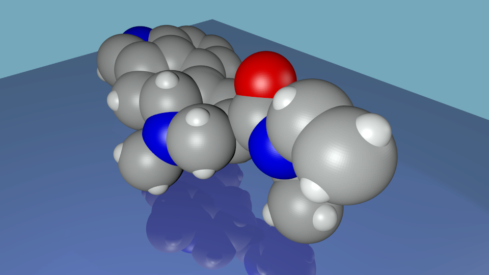

# MoloculeParser
==============

### Using Blender and Python Scripting to create 3D molecule models

This is a demonstration of 3D Animation of DNA created using Blender and Python Scripting. It was intended as an exercise in using Python and learning how to import external text data from files. Additionally I wanted to be able to parse that data and use it within the python script. The initial Python coding was done using IDLE (Python's Integrated Development Environment). In IDLE I tested my code to open the CSV text file, read each row from the file, separate each value from the row, and finally convert those values to floating point numbers. When I was happy with the results I just pasted the code into the Blender script window. I then added the lines to the script to import the BPY (Blender Python) module as well as the code to create the mesh spheres, and materials. If you want to run the parser without blender just comment out all of the blender bpy lines. It's worth noting that the parser works equally well with tab delimited files. Just change the line.split argument on line 33 from a comma to '\t'.

Beyond the general Python experience it was fun to see how a process such as model creation could be automated in Blender. Since the Blender/Python script reads in an external data file to create the model of the DNA molecule it's easy to change the molecule being created simply by pointing the script to another external data file.
### Sample Rendered in Blender

